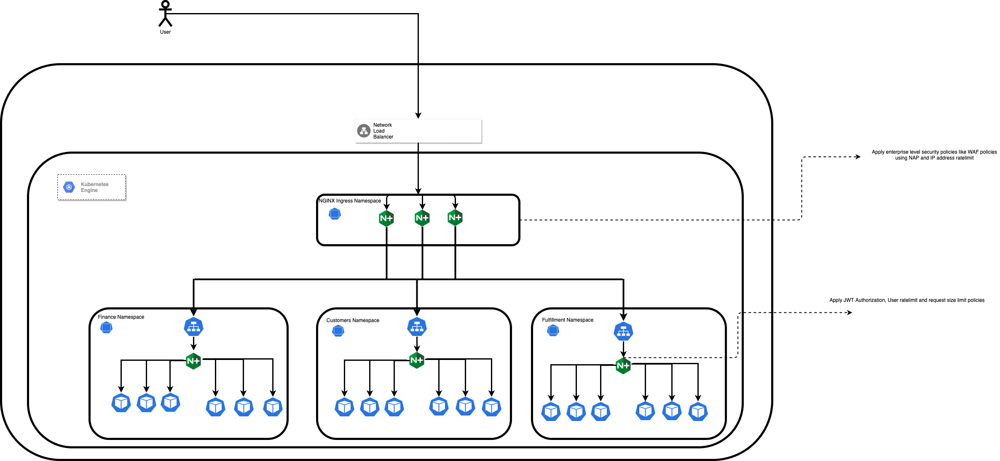

# Pre-requsite 1 - Install and configure Docker, Kubectl & Terraform
```
Install Docker      - <latest>
Install kubectl     - <latest>
Install Terraform   - <0.12>
```
# Get nginx-plus repo crt and keys
```
Download the license key nginx-repo.crt & nginx-repo.key from the F5 portal and place it the root directory.

```
# High level Architecture for Multi-Ingress Controller 

# To install GKE cluster and run NGINX Plus Ingress Controller & Prometheus 
[Refer GKE installation doc](docs/gke.md)

# To install AKS cluster and run NGINX Plus Ingress Controller & Prometheus 
[Refer AKS installation doc](docs/aks.md)

# To run Local(docker-desktop) NGINX Plus Ingress Controller & Prometheus 
[Refer Local installation doc](docs/local.md)


# Initialize Terraform workspace


After you've done this, initalize your Terraform workspace, which will download 
the provider and initialize it with the values provided in the `terraform.tfvars` file.

```shell
$ terraform init

Initializing the backend...

Initializing provider plugins...

The following providers do not have any version constraints in configuration,
so the latest version was installed.

To prevent automatic upgrades to new major versions that may contain breaking
changes, it is recommended to add version = "..." constraints to the
corresponding provider blocks in configuration, with the constraint strings
suggested below.

* provider.google: version = "~> 3.25"
* provider.kubernetes: version = "~> 1.11"
* provider.null: version = "~> 2.1"
```


Then, run plan `terraform plan`. 

```shell
$ terraform plan

# Output truncated...

Plan: 38 to add, 0 to change, 0 to destroy.

------------------------------------------------------------------------

Note: You didn't specify an "-out" parameter to save this plan, so Terraform
can't guarantee that exactly these actions will be performed if
"terraform apply" is subsequently run.
```

Run `terraform apply`. This will take approximately 15-20 minutes after your type `yes` - depends where you are running
```shell
# Output truncated...

Do you want to perform these actions?
  Terraform will perform the actions described above.
  Only 'yes' will be accepted to approve.

  Enter a value:
```

Output of the successful apply will look like this
```shell
# Output truncated...

Apply complete! Resources: 38 added, 0 changed, 0 destroyed.

Outputs:

grafana_dashboar_url = http://{external-ip-address}:3000
helloworld_api_url = curl --Header 'Host: localhost' http://{external-ip-address}:8080/helloworld
nginx_ingress_external_loadbalancer = http://{external-ip-address}:8080
weather_api_url = curl --Header 'Host: localhost' http://{external-ip-address}:8080/weather?city=melbourne

```
## Accessing the apps
```shell
$ curl --Header 'Host: localhost' http://{external-ip-address}:8080/weather?city=melbourne
```
```shell
curl --Header 'Host: localhost' http://{external-ip-address}:8080/helloworld
```
Access Grafana Dashboard
```
http://{external-ip-address}:3000
```
```
Default credentials for Grafana is admin/admin, feel free to set your credentials

Manually import https://grafana.com/grafana/dashboards/8588 for kubernetes

Manually import JSON for NGINX Plus ingress controller - https://github.com/nginxinc/nginx-prometheus-exporter/tree/master/grafana

```
## Things to know
```
# If you are running locally, you may not get the {external-ip-address} so feel free to add 'localhost'

# Successful terraform apply would update your ~/.kube/config with the cluster it has created and set it as current context. This was necessary as Terraform wasn't supporting CRD creation using its resources. so kubectl is being used create CRD

# Terraform destroy won't remove the context from ~/.kube/config, you would have to unset to work with your other kubernetes cluster

# NGiNX Plus Ingress Controller is deployed as daemon set , which means all the nodes will have one instance of NIC running. 

# Three nodes(VM's) are created as worker node by default for a cluster. Be mindful about how many nodes you create , the config is part of `terraform.tfvars`

# Grafana Dashboard is still NOT 100% working with all the metrics emitted by Kubernertes and NGiNX Plus Ingress Controller.
```
# Known challenges
```
You would be likely have an error while running terraform apply like
---
Error: clusterrolebindings.rbac.authorization.k8s.io is forbidden: User "<user>@<email>.com" cannot create resource "clusterrolebindings" in API group "rbac.authorization.k8s.io" at the cluster scope: requires one of ["container.clusterRoleBindings.create"] permission(s).
---
** If you are NOT an admin, You may need to raise a ticket with your admin to elevant the access to create cluster role  binding.
** If you are an admin , then refere here https://cloud.google.com/kubernetes-engine/docs/how-to/role-based-access-control
```

# To run demo cost effectively, please destroy once you are done.
Run `terraform destroy`. This will take approximately 15-20 minutes after your type `yes`
```shell
# Output truncated...

Plan: 0 to add, 0 to change, 38 to destroy.

Do you really want to destroy all resources?
  Terraform will destroy all your managed infrastructure, as shown above.
  There is no undo. Only 'yes' will be accepted to confirm.

  Enter a value:
```

Output of the successful apply will look like this
```shell
# Output truncated...

Destroy complete! Resources: 38 destroyed.

```


# TODO

```
# API Security (JWT)
# Auto TLS rotation
# OpenTracing
# Tighten RBAC
# Revisit some hardcoded string
# grpc support
# default-http-backend created with exposed node port as default
# Add more APIs
# NGINX Plus Ingress Controller metrics fix to Prometheus
# Auto imporing json for grafana  (https://github.com/nginxinc/nginx-prometheus-exporter/tree/master/grafana)
# Upgrade terraform to cater for CRD support currently on beta.
```
